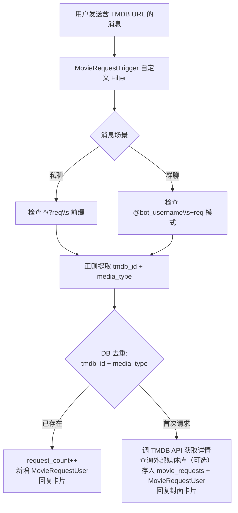

[English](./README_EN.md) | 中文

---

<!-- Community & Status -->


<!-- Ecosystem -->


<!-- Vibe -->


# ACP Plugins

> &reg; 2026 NovaHelix & SAKAKIBARA

**ADMINCHAT Panel 官方插件仓库** &mdash; 收录经过审核的第三方插件和官方示例插件。所有插件均遵循 ACP Plugin SDK 规范，支持通过 [ACP Market](https://acpmarket.novahelix.org) 一键安装。

---

## 已收录插件

| 插件 | 说明 | 版本 | 状态 |
|------|------|------|------|
| [movie-request](./movie-request/) | TMDB 求片系统 — 用户通过 Bot 提交 TMDB 链接，自动解析影片信息、去重合并、外部媒体库查询 | 1.0.0 | ✅ 已发布 |

---

## 求片系统 (Movie Request)

<details>
<summary><strong>求片通道 — 功能详情（点击展开）</strong></summary>

### 功能特性

- **TMDB 求片系统** &mdash; 用户通过 Bot 提交 TMDB 影片/剧集链接，自动解析详情并存储请求记录
- **智能触发规则** &mdash; 私聊 `/req` 命令触发，群聊 `@bot req` 触发，防止多 Bot 池重复响应
- **自动去重合并** &mdash; 相同影片的多次请求自动合并，请求计数递增，记录所有请求用户
- **TMDB API 多 Key 轮换** &mdash; 支持配置多个 TMDB API Key，自动轮换使用，应对 API 限流
- **可选外部媒体库查询** &mdash; 接入 PostgreSQL / MySQL 外部数据库，自动检查影片是否已入库
- **后台求片管理页面** &mdash; 管理员可在 Web 面板中查看、审批、拒绝求片请求

### 触发规则

| 场景 | 格式 | 触发 | 原因 |
|------|------|------|------|
| 私聊 | `/req TMDB_URL` | ✅ | 命令触发 |
| 私聊 | `req TMDB_URL` | ✅ | 简写触发 |
| 私聊 | 裸 TMDB URL | ❌ | 不识别为求片 |
| 群聊 | `@bot req TMDB_URL` | ✅ | @提及+req |
| 群聊 | `/req TMDB_URL` | ❌ | 防止 Bot 池多 Bot 重复触发 |

### 处理流程



### Bot 回复卡片示例

```
🎬 求片已记录

片名: 肖申克的救赎 (The Shawshank Redemption)
类型: 电影
年份: 1994
TMDB ID: 278
媒体库状态: ✅ 已入库 / ❌ 未入库 / ⚠️ 未配置

当前共 3 人请求此片
```

</details>

---

## 开发指南

想要开发自己的 ACP 插件？请使用 [ACP Plugin SDK](https://github.com/fxxkrlab/acp-plugin-sdk)。

### 快速开始

```bash
# 安装 SDK 和 CLI 工具
pip install acp-plugin-sdk

# 初始化插件项目
acp-cli init my-plugin

# 验证 manifest.json 和插件结构
acp-cli validate

# 构建插件包
acp-cli build

# 发布到 ACP Market
acp-cli publish
```

### 插件能力声明

ACP 插件支持以下五种能力声明（在 `manifest.json` 中配置）：

| 能力 | 说明 |
|------|------|
| `database` | 插件拥有独立数据库表（自动迁移） |
| `bot_handler` | 注册 Telegram Bot 消息处理器 |
| `api_routes` | 注册后端 API 路由 |
| `frontend_pages` | 提供前端页面（侧边栏入口） |
| `settings_tab` | 在设置页面添加配置标签页 |

### 相关链接

- [ACP Plugin SDK](https://github.com/fxxkrlab/acp-plugin-sdk) &mdash; 插件开发 SDK + CLI 工具
- [ADMINCHAT Panel](https://github.com/fxxkrlab/ADMINCHAT_PANEL) &mdash; 主项目
- [ACP Market](https://acpmarket.novahelix.org) &mdash; 插件市场

---

## License

本项目基于 [GPL-3.0](LICENSE) 协议开源。

&reg; 2026 NovaHelix & SAKAKIBARA. All rights reserved.

版权持有者可将代码用于商业用途（闭源）。第三方使用者必须遵守 GPL-3.0 协议保持开源。
